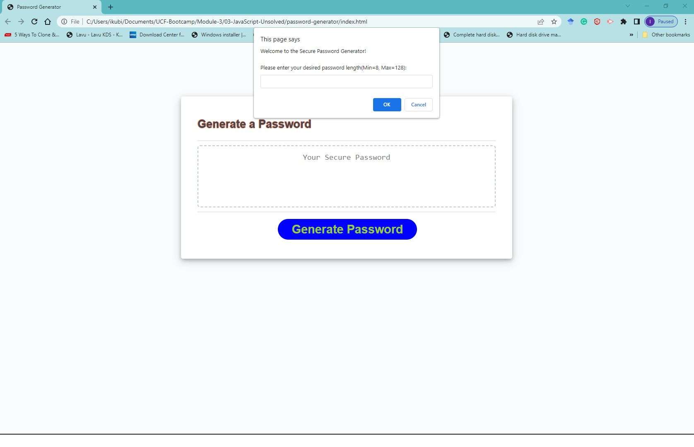
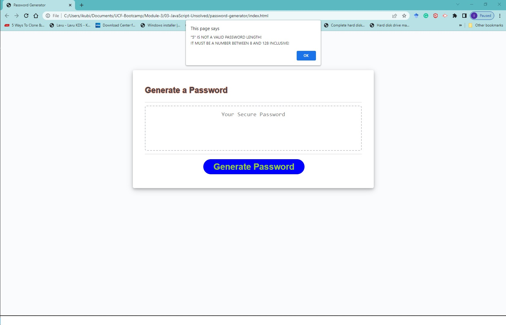
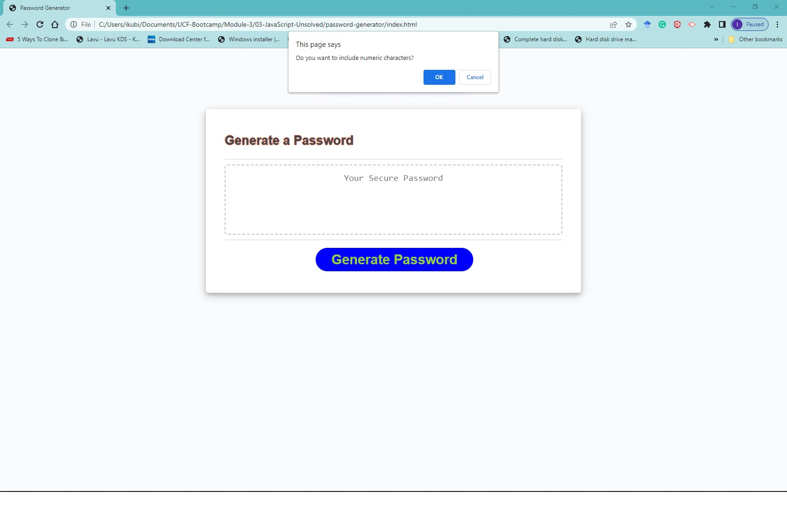
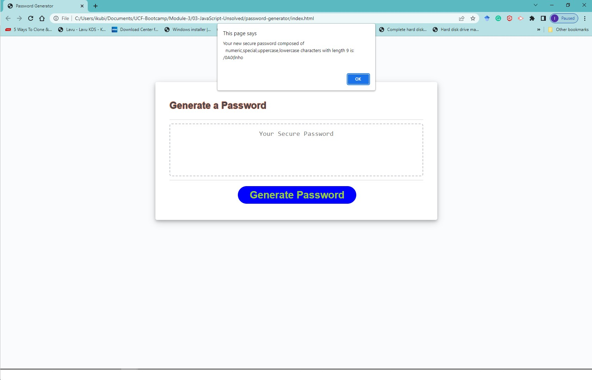
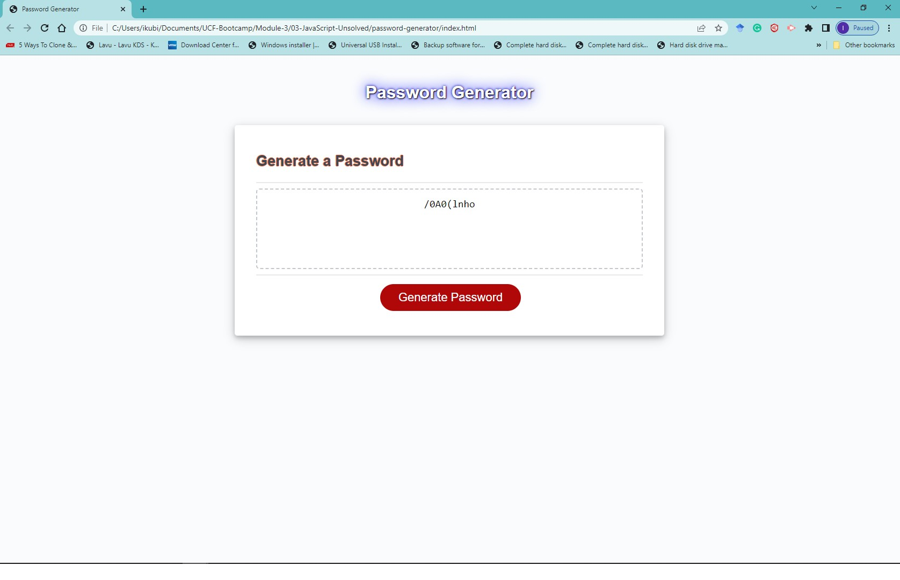
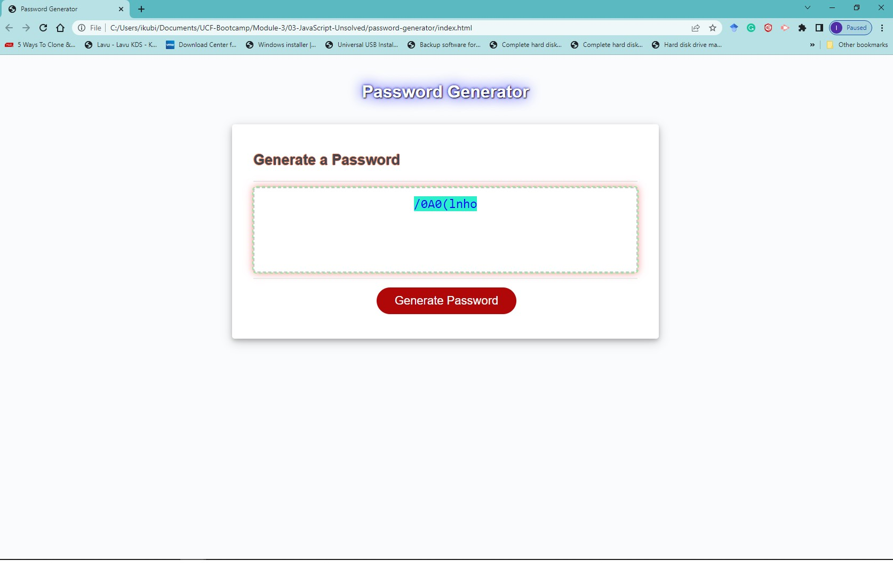

# Password Generator

## Description

This application enables employees or anyone to generate secure random passwords based on criteria that they’ve selected. The application uses four criteria based on lowercase, uppercase, numeric, and special characters to create passwords with a minimum length of 8 and a maximum of 128. This app will run in the browser and will features dynamically updated HTML and CSS powered by JavaScript code. It will have a clean and polished, responsive user interface that adapts to multiple screen sizes.

The password can include special characters selected among the [list of password special characters](https://www.owasp.org/index.php/Password_special_characters) from the OWASP Foundation.

My objectives for this application is based on the following user story and acceptance criteria;

### User Story

```
AS AN employee with access to sensitive data
I WANT to randomly generate a password that meets certain criteria
SO THAT I can create a strong password that provides greater security
```

### Acceptance Criteria

```
GIVEN I need a new, secure password
WHEN I click the button to generate a password
THEN I am presented with a series of prompts for password criteria
WHEN prompted for password criteria
THEN I select which criteria to include in the password
WHEN prompted for the length of the password
THEN I choose a length of at least 8 characters and no more than 128 characters
WHEN asked for character types to include in the password
THEN I confirm whether or not to include lowercase, uppercase, numeric, and/or special characters
WHEN I answer each prompt
THEN my input should be validated and at least one character type should be selected
WHEN all prompts are answered
THEN a password is generated that matches the selected criteria
WHEN the password is generated
THEN the password is either displayed in an alert or written to the page
```

## Installation

Please visit https://ikubiti.github.io/password-generator/

## Usage

The application consists of a text area and a button to generate a password. On clicking the generate password button, the user is presented with a series of prompts that asks for the password's length, and what characters to include. If the user makes any invalid selection such as choosing a length less than the minimum allowable length, the application presents a validation message to guide the user. 

Once a valid criteria is obtained, the application presents the user with a password strictly based on the criteria provided. The user may select the new password to copy for their purposes. The webpage is also designed for different screen sizes and is very responsive. 

The image below is the landing page a visitor gets when they enter the website address. 

Application prompting for the password's length after the "Generate Password" button is selected. 

If an invalid length is entered, the application displays a validation message with adequate information to guide the user to enter a valid length. 

The application proceeds to request for the addition of other criteria based on the acceptance requirements. 

If the user selected an insufficient number of requirements, the application presents the user with feedback guiding the user's next attempt. The minimum is 1 by default but can be varied. 

The application alerts the user with the new password generated. It shows all the user's requirements it used to generate the password. 

The application then presents the user the password in the text area. 

The user can click in the text area to select, highlight, and copy the password into the clipboard for use elsewhere. 


## Credits

N/A

## License

Licensed under the [MIT](LICENSE.txt) license.